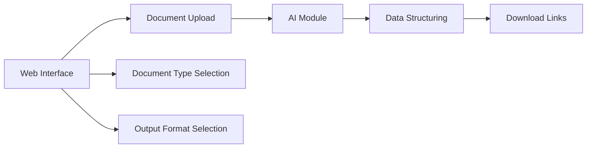

# aihds

''AIHDS'’ Platforma pro strukturování dat ve zdravotnictví

AiHDSP je projekt zabývající se vytvořením jednoduché aplikace/nástroje pro digitalizaci zdravotní dokumentace a dúkladnému přeformulování do správné struktury a formátu dat pro zdravotnická data podle aktuálních mezinárodních standartů. To bude provedeno díky Ai modulu openAi s moznosti OCR. Konkrétně to bude nástroj pro pro lékaře a zdravotnické pracovníky v české republice. Tento projekt bude sloužit ke zlepšení péče o pacienty, zefektivnění procesů a zvýšení kvality zdravotnických dat.

🟥 Vytvořit aplikaci pro převod nestrukturovaných zdravotnických dat (text, obraz) do strukturované elektronické podoby
🟥 Implementovat modul umělé inteligence pro analýzu a extrakci informací. 
🟥 Výstupní data budou ve formátech splňujících standardy EHDS a FHIR pro interoperabilitu
🟥 Jednoduché a intuitivní uživatelské rozhraní
---

# AIHDS - Platforma pro strukturování dat ve zdravotnictví


## Úvod

**AIHDS** (Artificial Intelligence Health Data Structuring) je projekt zaměřený na vytvoření aplikace/nástroje pro digitalizaci zdravotní dokumentace a převedení jejího obsahu do správné struktury a formátu podle aktuálních mezinárodních standardů pro zdravotnická data. Toho bude dosaženo pomocí AI modulu s využitím technologie OpenAI a možností OCR (Optical Character Recognition). Konkrétně se bude jednat o nástroj pro lékaře a zdravotnické pracovníky v České republice. Cílem projektu je zlepšit péči o pacienty, zefektivnit procesy a zvýšit kvalitu zdravotnických dat.

## Cíle projektu

- [x] Vytvořit aplikaci pro převod nestrukturovaných zdravotnických dat (text, obraz) do strukturované elektronické podoby
- [x] Implementovat modul umělé inteligence pro analýzu a extrakci informací s využitím modulu GPT-4 Vision bez nutnosti trénování vlastních modelů
- [x] Zajistit, aby výstupní data byla ve formátech splňujících standardy EHDS (European Health Data Space) a FHIR (Fast Healthcare Interoperability Resources) pro interoperabilitu
- [x] Vytvořit jednoduché a intuitivní uživatelské rozhraní

## Použité technologie

- **Umělá inteligence:** OpenAI, GPT-4 Vision
- **Databáze:** [doplnit]
- **Standardy:** FHIR, HL7, DICOM, SNOMED CT, ICD-10, CCDA
- **Backend:** [doplnit]
- **Frontend:** [doplnit]
- **UIX:** [Shadcn UI](https://github.com/shadcn-ui/ui)

## Funkce aplikace

- Nahrávání vstupních souborů různých formátů
- Volba typu dokumentu
- Analýza obsahu pomocí AI
- Extrakce strukturovaných informací
- Uložení do databáze
- Možnost exportu do CSV, JSON, PDF dle standardů
- Jednoduchá vizualizace a procházení výsledků

## Bezpečnost

- Autorizace uživatelů
- Anonymizace citlivých údajů
- Auditní záznamy
- Šifrování komunikace i uložených dat

## Dokumentace

- [Architektura, technický návrh](docs/architecture.md)
- [Popis implementace, knihoven](docs/implementation.md)
- [Návod pro uživatele](docs/user-guide.md)
- [Provoz a údržba systému](docs/maintenance.md)

## Architektura



## Technologie

- **Umělá inteligence:** OpenAI, GPT-4 Vision
- **Frameworky a API:**
  - [HAPI FHIR](https://hapifhir.io/) - API poskytující implementaci standardu FHIR pro výměnu zdravotnických informací

## Prompty

1. Jste pokročilý model umělé inteligence specializující se na zpracování a strukturování nestrukturovaných zdravotních dat. Vaším úkolem je:
   - Analyzovat a extrahovat relevantní informace z daných textových dat
   - Provádět analýzu textu a zpracování přirozeného jazyka 
   - Strukturovat extrahovaná data podle standardů EHR (Electronic Health Records) a FHIR
   - Zajistit přesnost, úplnost a konzistenci výsledných dat
   - Zachovat bezpečnost a soukromí extrahovaných dat

## Šablony pro strukturu zdravotní dokumentace

### JSON Šablona

```json
{
  "resourceType": "Patient",
  "id": "example",
  "identifier": [
    {
      "system": "http://examplehospital.com/fhir/ids",
      "value": "1234567"
    }
  ],
  "name": [
    {
      "use": "official",
      "family": "Novák",
      "given": ["Jan"]
    }
  ],
  "gender": "male",
  "birthDate": "1990-01-01",
  "address": [
    {
      "use": "home",
      "line": ["Ulice 123"],
      "city": "Praha",
      "postalCode": "11000"
    }
  ],
  "maritalStatus": {
    "coding": [
      {
        "system": "http://hl7.org/fhir/v3/MaritalStatus",
        "code": "M"
      }
    ],
    "text": "Married"
  },
  "telecom": [
    {
      "system": "phone",
      "value": "+420 777 666 555"
    },
    {
      "system": "email",
      "value": "jan.novak@email.com"
    }
  ],
  "contact": [
    {
      "relationship": [
        {
          "coding": [
            {
              "system": "http://hl7.org/fhir/v2/0131",
              "code": "E"
            }
          ]
        }
      ],
      "name": {
        "family": "Nováková",
        "given": ["Jana"]
      },
      "telecom": [
        {
          "system": "phone",
          "value": "+420 777 666 555"
        },
        {
          "system": "email",
          "value": "jana.novakova@email.com"
        }
      ],
      "address": {
        "use": "home",
        "line": ["Ulice 123"],
        "city": "Praha",
        "postalCode": "11000"
      }
    }
  ],
  "generalPractitioner": [
    {
      "reference": "Practitioner/example"
    }
  ],
  "managingOrganization": {
    "reference": "Organization/examplehospital"
  }
}
```

### XML Šablona

```xml
<Patient>
  <id value="example"/>
  <identifier>
    <system value="http://examplehospital.com/fhir/ids"/>
    <value value="1234567"/>
  </identifier>
  <name>
    <use value="official"/>
    <family value="Novák"/>
    <given value="Jan"/>
  </name>
  <gender value="male"/>
  <birthDate value="1990-01-01"/>
  <address>
    <line value="Ulice 123"/>
    <city value="Praha"/>
    <postalCode value="11000"/>
  </address>
  <maritalStatus>
    <coding>
      <system value="http://hl7.org/fhir/v3/MaritalStatus"/>
      <code value="M"/>
    </coding>
  </maritalStatus>
  <contact>
    <relationship>
      <coding>
        <system value="http://hl7.org/fhir/v2/0131"/>
        <code value="E"/>
      </coding>
    </relationship>
    <name>
      <family value="Nováková"/>
      <given value="Jana"/>
    </name>
    <telecom>
      <system value="phone"/>
      <value value="+420 777 666 555"/>
    </telecom>
  </contact>
  <generalPractitioner>
    <reference value="Practitioner/example"/>
  </generalPractitioner>
  <managingOrganization>
    <reference value="Organization/examplehospital"/>
  </managingOrganization>
  <Relations>
    <Relation value="org:founded_by"/>
  </Relations>
</Patient>
```

### HTML Šablona

```html
<!DOCTYPE html>
<html lang="cs">
<head>
  <meta charset="UTF-8">
  <meta name="viewport" content="width=device-width, initial-scale=1.0">
  <title>Návod k označování</title>
</head>
<body>
  <h1>Návod k označování</h1>
  <p>Zobrazte tyto instrukce uživatelům před začátkem označovacích úkolů. Pole pro instrukce podporuje HTML formátování a umožňuje integrovat obrázky a iframy (pdf).</p>
  <ol>
    <li>
      <p><strong>Informace o pacientovi:</strong></p>
      <p>Důkladně zkontrolujte informace o pacientovi. Ujistěte se, že máte správné údaje o pacientovi, včetně jména, pohlaví, data narození a adresy.</p>
    </li>
    <li>
      <p><strong>Identifikátor:</strong></p>
      <p>Zkontrolujte identifikátor pacienta. Potvrďte, že systém a hodnota odpovídají poskytnutému formátu (<code>http://examplehospital.com/fhir/ids</code>).</p>
    </li>
    <li>
      <p><strong>Jméno:</strong></p>
      <p>Ověřte jméno pacienta. Příjmení by mělo být zaznamenáno v poli "Family" a křestní jméno(y) v poli "Given". Ujistěte se o přesnosti a úplnosti.</p>
    </li>
    <li>
      <p><strong>Pohlaví:</strong></p>
      <p>Potvrďte, že je pohlaví pacienta správně zaznamenáno jako muž.</p>
    </li>
    <li>
      <p><strong>Datum narození:</strong></p>
      <p>Zkontrolujte datum narození pacienta a ujistěte se, že odpovídá poskytnutému formátu (RRRR-MM-DD).</p>
    </li>
    <li>
      <p><strong>Adresa:</strong></p>
      <p>Prohlédněte si adresu pacienta. Ujistěte se, že jsou správně zaznamenány ulice, město a PSČ.</p>
    </li>
    <li>
      <p><strong>Stav manželství:</strong></p>
      <p>Potvrďte, že je stav manželství pacienta správně zaznamenán. V tomto příkladu by měl být "Ženatý".</p>
    </li>
    <li>
      <p><strong>Kontaktní informace:</strong></p>
      <p>Zkontrolujte kontaktní údaje pro příbuznou osobu. Ověřte příjmení, křestní jméno(y), telefonní číslo a další kontaktní údaje.</p>
    </li>
  </ol>
  <p><strong>Poznámka:</strong> Pole pro instrukce podporuje HTML formátování. Můžete jej použít k formátování textu nebo k integraci obrázků a iframů (pdf) pro odkazy.</p>
</body>
</html>
```

## Další vhodné formáty

- **HTML** - Umožní generovat přehledné zobrazení údajů pacienta ve webovém formátu vhodném například pro tisk nebo archivaci. Lze využít CSS stylování.
- **PDF** - Široce podporovaný formát pro distribuci dokumentů a tisk. Vhodný pro archivaci karet pacientů. Lze převést z HTML pomocí nástrojů jako jsou Puppeteer nebo wkhtmltopdf.
- **Markdown** - Jednoduchý textový formát, který umožňuje základní formátování. Snadno čitelný a editovatelný.
- **YAML/JSON** - Univerzální textové formáty vhodné pro serializaci a přenos dat mezi aplikacemi.
- **Turtle/RDF** - Formáty založené na datech ve formě trojic. Umožňují reprezentovat linked data a ontologie.
- **Clinical Document Architecture (CDA)** - Standard HL7 pro reprezentaci klinických dokumentů.
- **OpenEHR Archetypes** - Specifikace pro modelování klinických dat.

## Cíl projektu

Cílem projektu je vytvořit nástroj/aplikaci, která umožňuje strukturovat a analyzovat zdravotnická data z různých zdrojů tak, aby byla připravena pro interoperabilitu s EHDS a FHIR standardy.

### Požadavky na projekt

- **Vstupy:**
  - Různé formáty vstupních dat: textové soubory, elektronické korespondence, fotografie zdravotnické dokumentace, scany zdravotnických dokumentaci, laboratorní zprávy a výsledky laboratorních analý, výstupy z diagnostických nástrojů, atd.
- **AI Modul:**
  - Vyhledávání a extrakce relevantních informací z různých vstupních formátů
  - Analýza textů a přirozeného jazyka
  - Následná analýza a zpracování identifikovaných informací
- **Data Structuring:**
  - Zpracování dat v souladu se standardy
  - Vytváření strukturovaného a uceleného záznamu pacienta
  - Ukládání dat do vhodné databáze, která umožňuje efektivní vyhledávání, analýzu a výpisy dat

## Standardy a metodiky pro zpracování a digitalizaci dat

- **Řízení kvality dat:** Zajišťuje přesnost, úplnost, včasnost a konzistenci dat.
- **Správa dat:** Zajišťuje celkovou správu dostupnosti, použitelnosti, integrity a zabezpečení dat.
- **Integrace dat:** Spojuje data z různých zdrojů do jednotného pohledu.
- **Zabezpečení dat:** Chrání data před neoprávněným přístupem a poškozením dat po celou dobu jejich životního cyklu.
- **Ochrana osobních údajů:** Zajišťuje, aby osobní údaje byly zpracovávány, ukládány a zpracovávány bezpečným způsobem.
- **Standardizace dat:** Přináší data ve společném formátu, který umožňuje společný výzkum, rozsáhlou analýzu a sdílení sofistikovaných nástrojů a metodik.
- **Interoperabilita dat:** Zajišťuje, aby si systémy a služby mohly vyměňovat data a interpretovat sdílené údaje.
- **Ukládání dat ve vhodných formátech:** Ukládá data ve formátech vhodných pro následné použití a interoperabilitu, jako jsou CSV, JSON, XML atd.
- **Digitalizace dat:** Převádí analogová data do digitální podoby pro snadné zpracování, ukládání a přenos.
- **Validace dat:** Kontrola přesnosti a kvality dat podle souboru kritérií.

## Mezinárodně uznávané standardy

- **HL7 (Health Level Seven International):** soubor mezinárodních standardů pro přenos klinických a administrativních dat.
- **DICOM (Digital Imaging and Communications in Medicine):** Standard pro přenos, ukládání, vyhledávání a sdílení lékařských snímků.
- **LOINC (Logical Observation Identifiers Names and Codes):** Databáze a univerzální standard pro identifikaci lékařských laboratorních pozorování.
- **SNOMED CT (Systematized Nomenclature of Medicine Clinical Terms):** Systematicky uspořádaná sbírka lékařských termínů, která obsahuje kódy, termíny, synonyma a definice.
- **ICD-10 (Mezinárodní klasifikace nemocí, desátá revize):** Seznam lékařských klasifikací Světové zdravotnické organizace.
- **FHIR (Fast Healthcare Interoperability Resources):** Standard pro elektronickou výměnu zdravotnických informací.
- **CCDA (Consolidated Clinical Document Architecture):** Standard značek vyvinutý organizací HL7, který specifikuje strukturu a sémantiku klinických dokumentů pro výměnu.

## Specifikace pro funkce AI modulu

Pro AI modul v tomto projektu by ideální instrukce vypadaly následovně:

Máte skvělou schopnost a jste velmi zkušený při následujících krocích:
- Dokonale a důkladně analyzovat různé formáty vstupních dat zdravotnické dokumentace, skenů zdravotnických dokumentů, laboratorních zpráv a výsledků laboratorních analýz, a výstupů z diagnostických nástrojů. 
- Identifikovat a extrahovat relevantní informace z těchto dat.
- Provést analýzu textu a zpracování přirozeného jazyka.
- Zpracovat identifikované informace. 
- Strukturovat výsledná data tak, aby byla v souladu se standardy EHDS a FHIR, a byla připravena pro interoperabilitu s těmito standardy.

## Závěr

Platforma AIHDS představuje komplexní řešení pro digitalizaci a strukturování zdravotnických dat s využitím umělé inteligence. Díky implementaci mezinárodních standardů a pokročilých technologií zpracování dat přispěje ke zlepšení kvality zdravotní péče, zefektivnění procesů a podpoře interoperability mezi různými systémy.

Klíčovými prvky platformy jsou:
- Využití AI modulu s technologií OpenAI a OCR pro analýzu a extrakci informací z různých formátů zdravotnické dokumentace.
- Strukturování dat podle standardů EHDS a FHIR pro zajištění interoperability.
- Intuitivní uživatelské rozhraní pro snadné nahrávání, zpracování a export dat.
- Důraz na bezpečnost a ochranu citlivých zdravotních údajů.

Při vývoji a implementaci platformy je nezbytné dodržovat uznávané standardy a metodiky pro zpracování a digitalizaci dat, jako jsou řízení kvality, správa dat, zabezpečení a ochrana osobních údajů.

Věříme, že platforma AIHDS bude významným přínosem pro zdravotnický sektor v České republice a pomůže zlepšit péči o pacienty a usnadnit práci lékařů a zdravotnických pracovníků.
